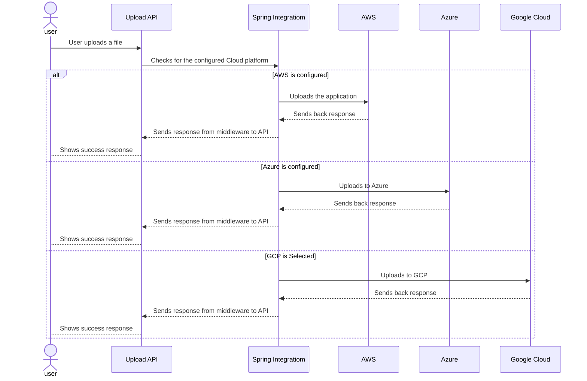

## EXL Hackathon

**Selected Theme**: Cloud Agnositc Upload Service to upload files to various cloud platforms. 

### Problem Statement

- Build a cloud agnostic solution to upload files upto 1GB in various cloud platforms such as AWS, Azure, or Google Cloud based on a configuration.
- Three functionalities should be provided at the very least, 
  - Upload API
  - Download API
  - Download API with a time limite for a temp user.

## Soultion

To achieve this, I've opted for a Spring Boot application powered by Spring Integration to develop a simple application. The following are the required perequisites:

- Spring Boot
- Spring Integration
- Spring Cloud Config Server
- Spring Cloud Config Client
- AWS account
- Azure Account
- Google Cloud Platform account
- Postman to test

### Included in the zip:

For this solution I have included the two projects, 

- Config Server: Where configuration propreties such as db details and other sensitive data comes from.
- File Service: The actual API that does the solution.
- Sql Scripts:  DDL scripts for the application, these can also be auto generated using hibernate properties, but I've included them with some master data. Please feel free to update them.
- Secrets:  A folder containing the spring yml files. Sensitive data is encrypted using jaspyt.

## Solution Design

### Basic Architecture Flow Chart

Please find below the design for the solution. 

## Sequence Diagram

- 

## About Me

Hi all, Just a small introduction, This is Bhavani Chandra. I'm a full stack developer at Jaggaer (Formerly, SciQuest). I'm a avid learner, belives in implementing solutions for problems that need a quick solution. 

Thanks to EXL for conducting this Hackathon. I'm really exited to submit a solution. 