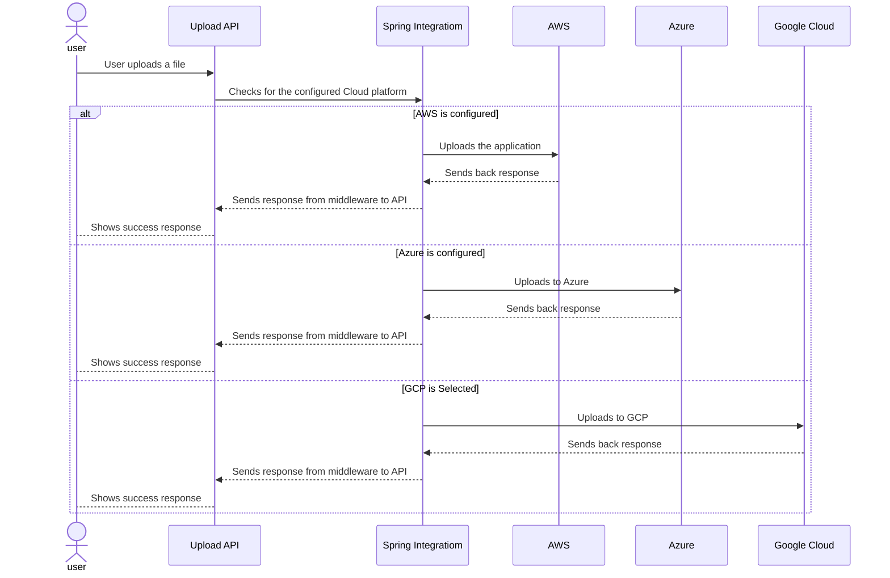
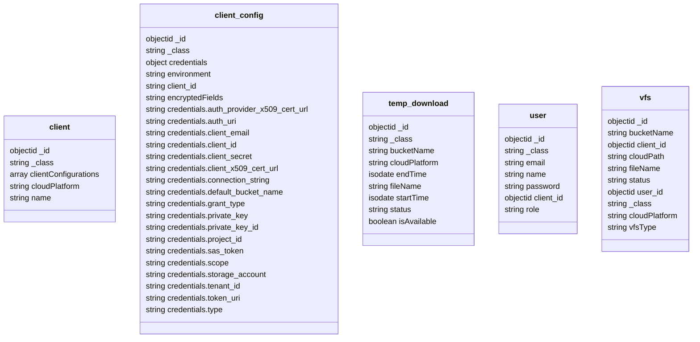

## EXL Hackathon

**Selected Theme**: Cloud Agnositc Upload Service to upload files to various cloud platforms. 

### Problem Statement

- Build a cloud agnostic solution to upload files upto 1GB in various cloud platforms such as AWS, Azure, or Google Cloud based on a configuration.
- Three functionalities should be provided at the very least, 
  - Upload API
  - Download API
  - Download API with a time limit for a temp user.

## Soultion

To achieve this, I've opted for a Spring Boot application powered by Spring Integration to develop a simple application. The following are the required perequisites:

- Spring Boot
- Spring Integration
- Spring Cloud Config Server
- Spring Cloud Config Client
- AWS account
- Azure Account
- Google Cloud Platform account
- Postman to test
- MongoDB - Using Free Atlas Cloud Shared Cluster

### Included in the zip:

For this solution I have included the two projects, 

- Config Server: Where configuration propreties such as db details and other sensitive data comes from.
- File Service: The actual API that does the solution.
- Mongo Collections:  MongoDB JSON data for the application. Please import them and check the data and how the data is encrypted.
- Secrets:  A folder containing the spring yml files. Sensitive data is encrypted using jaspyt.

## Assumptions:

These are the following assumptions for the solution.

- Users will upload one file at a time: The solution is flexible enough to add extra logic to achieve this.
- Cloud credentials are added during initial configuration.
- There will be a super admin that will initiate the configuration
- Only these operations are required: Download, Upload and Download for a temp user.
- For temporary download, the file is downloaded to server and give server static url and start a timer to delete the file from local once timer is done.

## Solution Design

### Basic Architecture Flow Chart

Please find below the design for the solution. 

## Sequence Diagram

## Application Architecture

I'm using Java Spring Boot with Spring Integration. Currently the app contains two services

- Config Server: Here all the configurations reside. Secrets are encrypted using Jaspyt.
- FileService: This is the main app that acts as Client and Integration Service.

## ER Diagram

## About Me

Hi all, Just a small introduction, This is Bhavani Chandra. I'm a full stack developer at Jaggaer (Formerly, SciQuest). I'm a avid learner, believes learning, doing. 

Thanks to EXL for conducting this Hackathon. I'm really exited to submit this solution. 